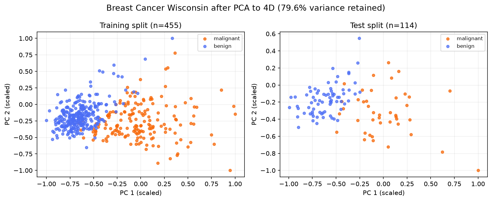
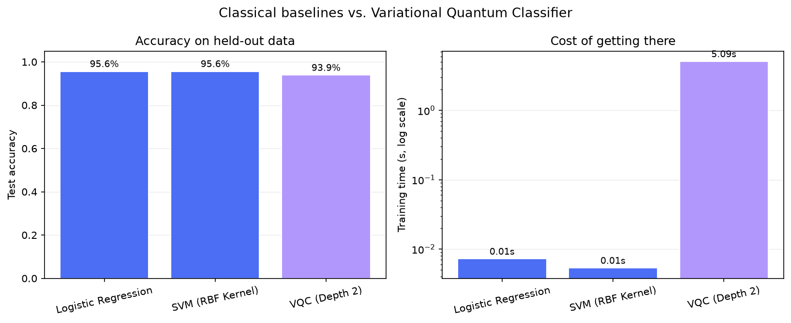
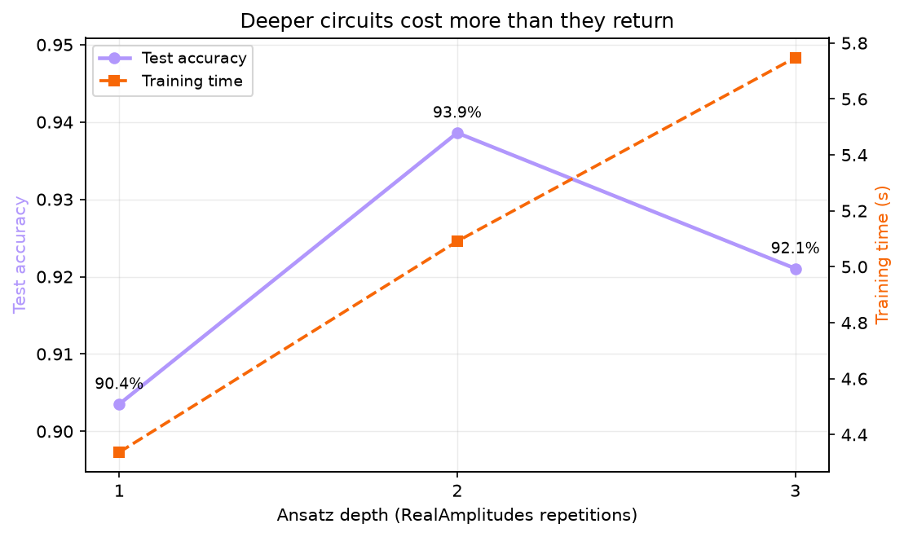
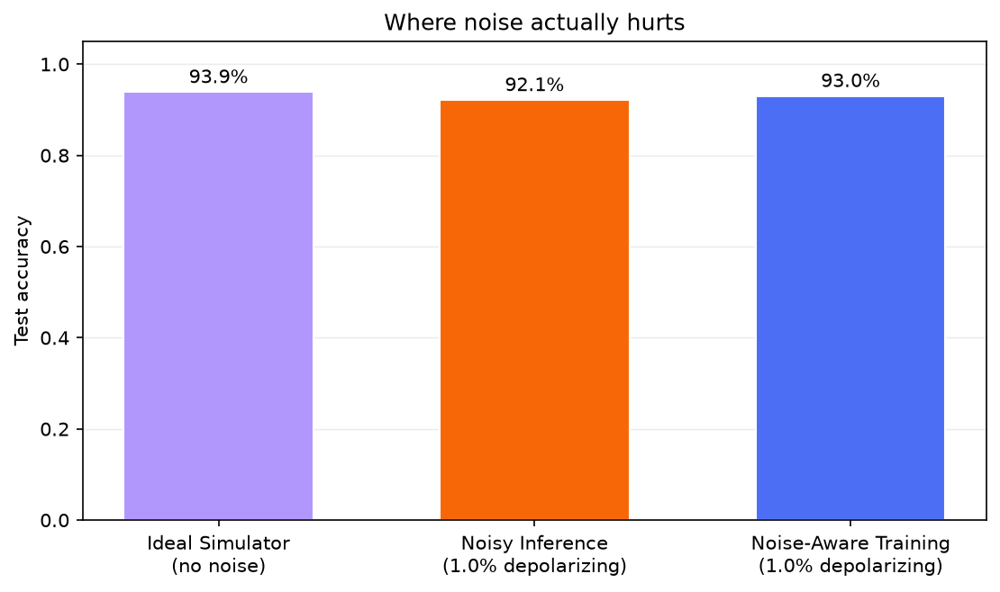
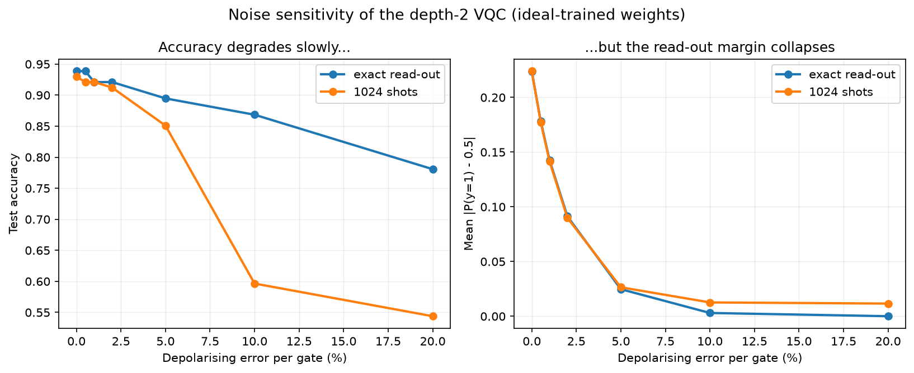
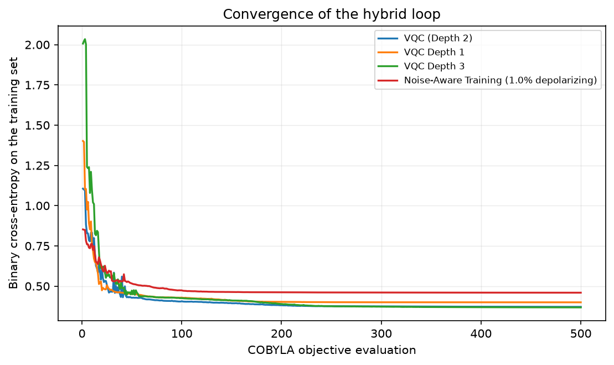
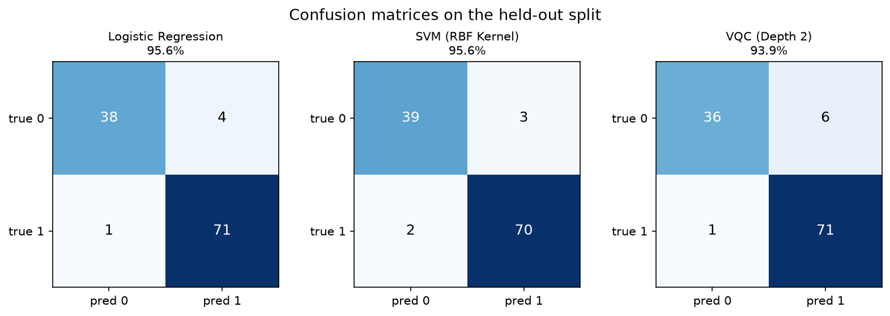

# QML-Compare: Variational Quantum Classification

**Authors:** Anurag Jha, Sandesh Dhital

Every number in this document was produced by `qml-compare run` on the
committed configuration (`configs/default.json`, seed 42) and can be
regenerated with one command. The raw output lives in
[`../results/`](../results): `report.md`, `results.csv`, `results.json` and the
figures referenced below.

---

## 1. Introduction

This project sits at the intersection of quantum computing and machine
learning. It implements a Variational Quantum Classifier (VQC), benchmarks it
honestly against standard classical algorithms on identical data, and then
asks the two questions that decide whether such a model is usable today:

1. Does adding depth to the quantum circuit buy accuracy, and at what cost?
2. What does hardware noise actually do to a trained variational model?

The short answer to both is more interesting than "it gets worse". Depth pays
once and then stops paying. Noise degrades a VQC's *confidence* far faster
than its *decisions* — and it is the interaction between noise and a finite
shot budget, not noise alone, that makes NISQ-era deployment hard.

## 2. VQC background

A Variational Quantum Classifier is a hybrid quantum-classical algorithm. A
Parameterized Quantum Circuit (PQC) maps each input into a high-dimensional
Hilbert space; a subset of its gates carry trainable parameters. A classical
optimiser adjusts those parameters to minimise a cost function, forming a
feedback loop:

```
        ┌──────────────────────── classical optimiser (COBYLA) ────────────────────────┐
        │                                                                              │
        v                                                                              │
  theta ──> | encode x | ──> | ansatz U(theta) | ──> measure ──> P(y=1|x) ──> loss ─────┘
```

The quantum device evaluates the state; the classical computer decides where
to look next. Nothing about the loop requires the quantum part to be a real
device — here it is a simulator, which is what makes the noise study possible
at all.

## 3. Dataset

**Breast Cancer Wisconsin** (binary: malignant / benign), bundled with
scikit-learn — 569 samples, 30 features.

| Property | Value |
| --- | --- |
| Training samples | 455 |
| Test samples | 114 |
| Features after PCA | 4 (= 4 qubits) |
| Variance retained | 79.6% |
| Feature range | `[-1, 1]` |
| Split | 80 / 20, stratified, seed 42 |

**Preprocessing.** The 30 raw features are standardised, projected onto 4
principal components, and rescaled to `[-1, 1]` so the values can be used
directly as rotation angles. Four components keeps the simulation at 16
amplitudes — tractable on a laptop — while retaining nearly 80% of the
variance.

**One deviation from the original specification, on purpose.** The split
happens *first*, and the scaler and PCA are fitted on the training rows only.
Fitting them on the full dataset before splitting leaks test-set structure
into the model and inflates every accuracy reported afterwards. Test features
are clipped back into `[-1, 1]` after transformation, since a held-out point
may legitimately fall outside the training range.



The projection also sets expectations: the two classes are largely, but not
perfectly, separable in the first two components. A model scoring 100% here
would be a bug, not a breakthrough.

## 4. Classical baselines

Both baselines see exactly the same preprocessed arrays as the VQC — same
projection, same scaling, same split. Anything else would make the comparison
meaningless.

- **Logistic Regression** — linear decision boundary, `max_iter=1000`.
- **Support Vector Machine** — RBF kernel, `C=1.0`, `gamma="scale"`.

## 5. Quantum circuit design

```
|0>^4 ── ZZFeatureMap(x, reps=2, full) ── RealAmplitudes(theta, reps=d) ── measure
```

**Feature encoding.** A `ZZFeatureMap` on 4 qubits: Hadamards, single-qubit
Z rotations proportional to each feature, and entangling ZZ interactions
between every pair. The entanglement is what makes the encoding non-classical
— it creates feature correlations no linear model can express.

**Ansatz.** `RealAmplitudes` with `d` repetitions: layers of trainable `Ry`
rotations followed by CNOT entanglers, giving `4 x (d + 1)` weights.

**Read-out.** The parity of the measured bit-string decides the class, which
is the `<Z^⊗4>` expectation value in a form that also works from raw counts:

```
P(y = 1 | x) = sum of probabilities over odd-parity basis states
             = (1 - <Z^⊗4>) / 2
```

### The encoding detail that decided the whole project

Qiskit's `ZZFeatureMap` encodes the interaction between features `i` and `j`
as a phase `2 * prod(pi - x_k)`. With features scaled to `[-1, 1]`, every
pairwise phase lands between roughly **9 and 34 radians**. The encoded state
oscillates several times across the data range, so two nearby samples end up
in unrelated corners of Hilbert space and the optimiser has nothing to follow.

Replacing it with the plain product `prod(x_k)` keeps every interaction phase
within `[-2, 2]` radians. Same circuit, same optimiser, same data:

| Data map | Test accuracy |
| --- | --- |
| Qiskit default, `prod(pi - x_k)` | 82.5% |
| Plain product, `prod(x_k)` | **92.1%** |

Nearly ten percentage points, from one line. Both remain selectable through
`circuit.feature_map_data_map`, because being able to reproduce the failure is
part of the result:

```bash
qml-compare run --study baseline --config configs/qiskit-datamap.json
```

## 6. Implementation workflow

Python, Qiskit and scikit-learn. The pipeline:

1. **Load** the Breast Cancer dataset.
2. **Split** 80/20, stratified.
3. **Preprocess** — standardise, PCA to 4 components, scale to `[-1, 1]`;
   all fitted on the training split.
4. **Encode** each sample with the `ZZFeatureMap`.
5. **Transform** with the `RealAmplitudes` ansatz.
6. **Measure** the parity of the computational basis outcome.
7. **Score** with binary cross-entropy against the labels.
8. **Optimise** the weights with COBYLA (500 objective evaluations).
9. **Predict** by thresholding `P(y = 1 | x)` at 0.5.

The training loop is implemented directly on Qiskit primitives rather than
through `qiskit-machine-learning`'s `VQC` class. That was a deliberate call:
it gives control over the read-out, the loss and the per-iteration history,
and it removes a dependency that historically lags Qiskit releases. It also
enabled the optimisation in the next paragraph.

**Why it runs in seconds.** A naive implementation simulates one circuit per
sample per iteration — 455 x 500 = 227,500 simulations per training run.
Because the feature map does not depend on the weights, the encoded states are
computed once and cached, and each iteration applies the ansatz as a single
16x16 unitary to the whole batch in one matrix product. Full derivation in
[architecture.md §4](architecture.md#4-backends-where-the-performance-came-from).

## 7. Circuit depth experiment

The VQC was trained at depths 1, 2 and 3 — one, two and three repetitions of
the rotation-and-entanglement block — with everything else held fixed.

## 8. Noise experiment

Real quantum hardware is noisy, so a depolarising channel is attached to every
one- and two-qubit gate in the transpiled circuit. Three arms, because
reporting a single "with noise" number hides the question that matters:

1. **Ideal** — noiseless statevector simulation; the reference.
2. **Noisy inference** — weights trained in simulation, then deployed on the
   noisy backend without retraining. This is what "running your trained model
   on hardware" means.
3. **Noise-aware training** — the optimiser itself sees the noisy backend and
   can compensate.

A fourth study sweeps the gate error rate from 0% to 20%, at both exact
read-out and a 1024-shot budget.

By default the noisy backend returns **exact** density-matrix probabilities
(the infinite-shot limit), so the measured effect is decoherence alone.
Sampling noise is added back with `--shots`, which turns out to matter a great
deal (§10.4).

## 9. Classical vs. VQC comparison

Models are compared on:

- **Test accuracy** — fraction correctly classified on held-out data.
- **F1 and ROC-AUC** — balance and ranking quality, in case accuracy flatters.
- **Training time** — wall-clock seconds to a fitted model.
- **Read-out margin** — mean `|P(y=1) - 0.5|`, how confidently the model
  decides. Introduced for the noise study, where it turns out to be the metric
  that moves first.

## 10. Results

Seed 42, `configs/default.json`, 16-core laptop CPU, total run 5 min 20 s.
Full tables in
[`../results/report.md`](../results/report.md).

### 10.1 Classical vs. VQC (depth 2, noiseless)

| Model | Test Accuracy | F1 | ROC-AUC | Training Time |
| --- | --- | --- | --- | --- |
| Logistic Regression | 95.6% | 0.966 | 0.993 | 0.01 s |
| SVM (RBF Kernel) | 95.6% | 0.966 | 0.992 | 0.01 s |
| VQC (Depth 2) | 93.9% | 0.953 | 0.979 | 5.09 s |



**Observation.** The VQC is competitive — 1.7 percentage points behind both
classical models, which amounts to two extra misclassifications out of 114 —
but it costs roughly **700x** more training time to get there. And that is
against a heavily optimised statevector shortcut; on real hardware, or with a
naive per-sample simulation, the gap widens by orders of magnitude.

The classical models are not just faster, they are *unfairly* faster: this
problem is nearly linearly separable in the first principal components, which
is precisely the regime classical methods own.

### 10.2 Impact of circuit depth (noiseless)

| VQC Depth | Trainable Weights | Test Accuracy | Training Time | Change |
| --- | --- | --- | --- | --- |
| 1 | 8 | 90.4% | 4.34 s | baseline |
| 2 | 12 | **93.9%** | 5.09 s | +3.5 pp |
| 3 | 16 | 92.1% | 5.75 s | −1.8 pp |



**Observation.** Depth 1 underfits: eight weights cannot shape the decision
boundary enough. Depth 2 adds four weights and gains 3.5 points. Depth 3 adds
four more, costs 33% more training time than depth 1, and *loses* accuracy —
the extra parameters overfit 455 samples and make the loss surface harder for
a gradient-free optimiser to navigate.

Expressibility is not accuracy. Past the point where the ansatz can represent
the boundary, more layers only add ways to get lost.

### 10.3 Impact of noise (depth 2)

| Condition | Test Accuracy | F1 | ROC-AUC | Training Time |
| --- | --- | --- | --- | --- |
| Ideal simulator (no noise) | 93.9% | 0.953 | 0.979 | 5.09 s |
| Noisy inference (1% depolarizing) | 92.1% | 0.939 | 0.979 | 5.09 s |
| Noise-aware training (1% depolarizing) | 93.0% | 0.947 | 0.977 | 265.32 s |



**Observation.** Deploying ideal-trained weights on a 1%-error backend costs
1.8 points — noticeable, not catastrophic. Retraining under the same noise
recovers about half of that, and costs **52x** more training time, because
noisy simulation cannot use the cached-state shortcut.

This is a much smaller drop than the naive expectation, and the reason is
structural: a depolarising channel contracts every probability towards 0.5,
and 0.5 is exactly the decision threshold. The predictions survive. What does
not survive is the model's confidence — which the sweep makes visible.

### 10.4 Noise sweep: accuracy is a lagging indicator

| Gate Error | Read-out | Accuracy | ROC-AUC | Mean Margin |
| --- | --- | --- | --- | --- |
| 0.0% | exact | 93.9% | 0.979 | 0.224 |
| 0.0% | 1024 shots | 93.0% | 0.978 | 0.224 |
| 0.5% | exact | 93.9% | 0.978 | 0.178 |
| 0.5% | 1024 shots | 92.1% | 0.975 | 0.178 |
| 1.0% | exact | 92.1% | 0.979 | 0.143 |
| 1.0% | 1024 shots | 92.1% | 0.974 | 0.141 |
| 2.0% | exact | 92.1% | 0.978 | 0.091 |
| 2.0% | 1024 shots | 91.2% | 0.971 | 0.090 |
| 5.0% | exact | 89.5% | 0.972 | 0.025 |
| 5.0% | 1024 shots | 85.1% | 0.920 | 0.026 |
| 10.0% | exact | 86.8% | 0.967 | 0.003 |
| 10.0% | 1024 shots | **59.6%** | 0.648 | 0.013 |
| 20.0% | exact | 78.1% | 0.947 | 0.000 |
| 20.0% | 1024 shots | 54.4% | 0.561 | 0.012 |



**Three things happen here, and only one of them is visible in accuracy.**

*The margin collapses first.* From 0.224 to 0.003 by 10% error — a 75x loss
of signal — while accuracy has fallen only 7 points. The model is still
usually right, but it is no longer meaningfully *deciding*: every prediction
sits within a hair of the threshold.

*Ranking survives longest.* ROC-AUC stays above 0.96 out to 10% error under
exact read-out. The information is still in the state; it is just compressed
into an ever-thinner band around 0.5.

*Sampling noise is what finally kills it.* At 10% error the exact read-out
scores 86.8%, but the same weights on the same backend with 1024 shots score
**59.6%** — barely better than guessing. The reason is arithmetic: the mean
margin is 0.003, while the standard error of a 1024-shot estimate is about
0.016. The signal has dropped five times below the sampling floor, so every
prediction is a coin flip.

**This is the practical NISQ limit, stated precisely.** A VQC does not fail
because noise makes it wrong. It fails because noise shrinks the read-out
signal below what a realistic shot budget can resolve. Halving the gate error
buys roughly a doubling of the margin; recovering the same signal by adding
shots costs 4x the measurements. Error mitigation is the cheaper lever.

### 10.5 Convergence



COBYLA converges within roughly 300 of its 500 evaluations at every depth. The
noise-aware run plateaus at a visibly higher loss: the noisy backend cannot
produce confident probabilities, so cross-entropy has a floor it cannot get
under regardless of the weights.

### 10.6 Confusion matrices



All three models fail in the same direction — the residual errors are
malignant cases classified as benign, the costly direction for this dataset.
That is a property of the PCA projection, not of any one classifier, and it
would need to be addressed before anything here went near a clinical setting.

## 11. Limitations

**Simulator constraints.** Everything runs on classical simulation. Cost grows
as `2^n`; beyond 12-14 qubits a laptop starts swapping. That caps the feature
count at 4, which discards 20% of the dataset's variance before training even
begins — a real handicap the classical baselines do not carry.

**Small, clean dataset.** 569 samples, no missing values, nearly linearly
separable. Exactly the regime where classical methods are strongest, and where
114 test samples make one misclassification worth 0.9 percentage points. The
±1.7 point gap in §10.1 is two samples wide.

**Single split, single seed.** All headline numbers come from one stratified
split at seed 42. Differences under about 2 points should not be treated as
significant without a repeated-split study — `--seed` makes that cheap for the
noiseless arms.

**Training cost.** Even with the cached-state optimisation, the VQC is ~700x
slower to train than the classical baselines, and noise-aware training is 50x
slower again. Without that optimisation it would be far worse.

**Idealised noise.** A uniform depolarising channel on every gate is a crude
stand-in for real hardware: no crosstalk, no drift, no `T1`/`T2`, no
qubit-specific error rates. Real devices are noisier and less uniform, so the
sweep should be read as a lower bound.

**No error mitigation.** No zero-noise extrapolation, no readout-error
correction, no measurement calibration. Since §10.4 identifies signal
compression as the binding constraint, mitigation is the obvious next step —
and the sweep gives a concrete target: keep the mean margin above the shot
noise floor of `0.5 / sqrt(shots)`.

## 12. Conclusion

The VQC works. On identical preprocessed data it reaches 93.9% test accuracy
against 95.6% for both classical baselines — competitive, and clearly learning
real structure rather than a lucky threshold.

It is also, on every practical axis, the worse choice for this problem. It
trains roughly 700 times slower for 1.7 fewer points of accuracy, needs the
data compressed to a quarter of its dimensionality before it can be run at
all, and depends on an encoding detail (§5) that costs ten points of accuracy
if it is left at the library default.

The depth study shows expressibility saturating quickly: depth 2 is the sweet
spot, and depth 3 is strictly worse for more money. The noise study reframes
the usual NISQ complaint. A VQC under 1% depolarising noise loses less than
two points of accuracy, which sounds survivable. But its read-out margin —
the actual signal — falls by 36%, and at 10% error the margin drops five times
below the noise floor of a 1024-shot measurement, at which point accuracy
collapses from 86.8% to 59.6%. **Noise does not make a variational classifier
wrong; it makes it unreadable.**

That distinction matters for where effort should go. If accuracy were the
thing degrading, better ansätze would help. Since it is the read-out signal,
the productive levers are error mitigation and encodings that produce larger
margins — and the mean margin, not accuracy, is the metric to watch while
pursuing them.

For standard tabular data of this size, classical machine learning remains
decisively better. The value in a VQC today is in understanding what will need
to be true for that to change.

---

## Reproducing this document

```bash
pip install -e ".[dev]"
qml-compare run          # ~7 minutes; writes results/ end to end
pytest                   # the test suite
```

See [experiments.md](experiments.md) for the full configuration reference and
[architecture.md](architecture.md) for the design decisions behind the
implementation.
